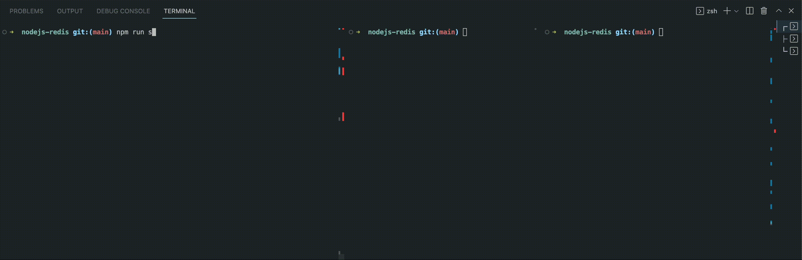

# Redis with Node.js



## Project setup

## Install Requirements
```
npm install
```

## To see the operation of functions set, get, append, del, exists, sadd, sinter and srem.
```
npm run start (it will start with nodemon)
```

## To see the operation of functions publish and subscribe.
#### First, open two different terminals side by side.
#### Then run the following command in the first terminal;
```
node subscriber.js
```
#### Finally, run the following command in the second terminal;
```
node publisher.js
```
